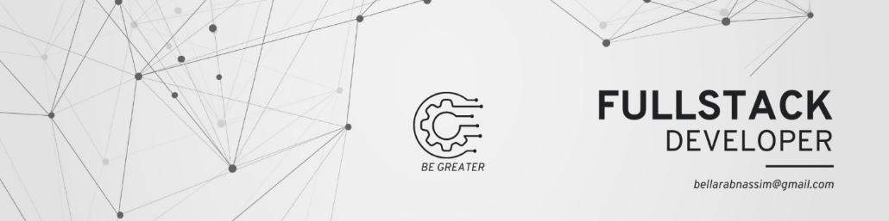

<h1 align="left">Hello World!, I'm Nassim, a Moroccan Web Developer 👋🏼:</h1>

###

I am a Computer Science student with a passion for web development, specializing in front-end and back-end technologies.💡

###

<h2 align="left">🙋‍♂️ About me</h2>

###

🌍 Location: Salé, Morocco 👨‍💻 Started Programming: 2021 📚 Currently Working On: Completing the Java Oracle Certification 🎓 Plan: Working towards and completing the React Advanced Certification on Coursera 🎯 Goals: Master the concepts of both backend and frontend development 🤓 Fun Fact: I love solving complex coding challenges and view them as fun puzzles to crack!

###

<h2 align="left">💬 Contact</h2>

###

📧 Email: nassim.bellarab@example.com 🔗 LinkedIn: Nassim Bellarab

###

<h2 align="left">💻 Tech Stack:</h2>

###

  
  
  
  
  
  
  
  
  
  
  
  
  
  
  
  
  
  
  
  
  
  
  
  
  
  
  
  
  
  
  
  
  
  
  
  
  
  
  
  
  
  
  
  
  
  
  

###

<picture>
  <source media="(prefers-color-scheme: dark)" srcset="https://raw.githubusercontent.com/bellarab/bellarab/output/github-snake-dark.svg" />
  <source media="(prefers-color-scheme: light)" srcset="https://raw.githubusercontent.com/bellarab/bellarab/output/github-snake.svg" />
  
</picture>

###

  

###
